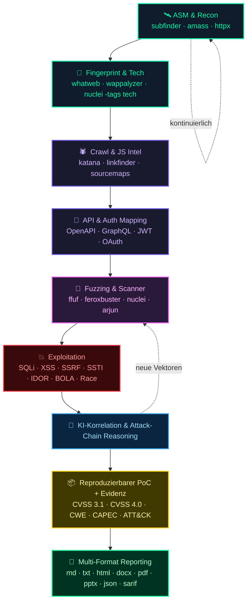

<p align="center">
  
</p>

# 🕷️ HackingWebbyDM20911

> **Offensiver Web-Hacking-Copilot** — Recon, Exploitation, KI-gestützte Korrelation, Attack-Chaining und seniorenreifes Multi-Format-Reporting.

🌐 **Sprachen:** [Español](README.md) · [English](README.en.md) · [Português](README.pt.md) · [Français](README.fr.md) · [Deutsch](README.de.md) · [Italiano](README.it.md) · [日本語](README.ja.md)

Claude Code / Claude Desktop Skill für Profis im offensiven Web-Pentesting. Bündelt Methodik, Tooling, empfohlene MCPs und einen integrierten Multi-Format-Berichtsgenerator (Markdown, Word, PDF, HTML, PowerPoint, JSON, SARIF).

## ⚡ Schnellinstallation

```bash
npx skills add DM20911/HackingWebbyDM20911
```

---

## Was es macht

End-to-End offensiver Copilot:

- **Recon / OSINT / ASM** — Subdomains, Endpoints, JS Intel, Source Maps, Secret Hunting.
- **Fuzzing & Scanner** — ffuf, feroxbuster, nuclei, sqlmap, dalfox, XSStrike.
- **Exploitation** — SQLi, XSS, SSRF, SSTI, Deserialization, IDOR/BOLA, Mass Assignment.
- **API tiefgreifend** — REST, GraphQL (Introspection, Batching, Depth, Alias), SOAP.
- **Auth Deep Dive** — JWT, OAuth2/OIDC, SAML, Sessions, MFA-Bypass, Race Conditions.
- **Cloud + K8s + CI/CD** — AWS/GCP/Azure SSRF + IAM, kube-hunter, GitHub Actions Abuse.
- **Browser-Sicherheit** — CSP-Bypass, postMessage, Service Workers, XS-Leaks, SameSite.
- **Business-Logic-Missbrauch** — Workflows, Race, Coupon/Refund/Transfer, Eskalation.
- **Attack Chaining** — intelligente Korrelation für kritische Ketten.
- **Senior-Reporting** — CVSS 3.1 + 4.0, CWE, CAPEC, ATT&CK, Attack Chains, Beweise; Export nach md/docx/pdf/html/pptx.

---

## Aufruf

In **Claude Code** oder **Claude Desktop**:

- `/hackweb`
- `/HackingWebbyDM20911`
- *„auditiere diese Web-App"*, *„Recon zu target.cl"*, *„Pentest dieser API"*
- *„exploite diese Vuln"*, *„suche BOLA / IDOR"*, *„SSRF in diesem Parameter"*
- *„prüfe OAuth/JWT"*, *„greife dieses GraphQL an"*
- *„generiere den offensiven Bericht"*

Die Skill fragt immer nach Methodik und Mindestdaten, bevor sie aktiv ausführt.

---

## Boot — Methodikauswahl

Erster Schritt vor jeder aktiven Ausführung:

```
Mit welcher Methodik möchtest du arbeiten?
  1. PTES
  2. OWASP WSTG
  3. NIST SP 800-115
  4. OSSTMM
  5. MITRE ATT&CK
  6. CWE / CAPEC
  7. Hybrid (mehrere kombinieren)
  8. Manuelle Auswahl
```

Die Wahl bleibt als Project Memory bestehen, damit sie in folgenden Sessions desselben Engagements nicht erneut gefragt wird. Siehe `references/methodologies.md`.

---

## Offensive Pipeline



---

## Tool-Stack

<div align="center">


#### 🛰️ Recon / OSINT / ASM

[](https://github.com/projectdiscovery/subfinder) [](https://github.com/owasp-amass/amass) [](https://github.com/tomnomnom/assetfinder) [](https://github.com/Findomain/Findomain) [](https://github.com/projectdiscovery/httpx) [](https://github.com/projectdiscovery/katana) [](https://github.com/hakluke/hakrawler) [](https://github.com/lc/gau) [](https://github.com/tomnomnom/waybackurls) [](https://github.com/projectdiscovery/dnsx) [](https://github.com/projectdiscovery/naabu) [](https://github.com/robertdavidgraham/masscan) [](https://nmap.org) [](https://github.com/michenriksen/aquatone) [](https://github.com/lanmaster53/recon-ng) [](https://github.com/laramies/theHarvester)

#### 🛰️ Proxy / Interceptación

[](https://portswigger.net/burp) [](https://www.zaproxy.org) [](https://caido.io) [](https://mitmproxy.org) [](https://github.com/projectdiscovery/proxify)

#### 🎯 Fuzzing

[](https://github.com/ffuf/ffuf) [](https://github.com/epi052/feroxbuster) [](https://github.com/maurosoria/dirsearch) [](https://github.com/OJ/gobuster) [](https://github.com/s0md3v/Arjun) [](https://github.com/devanshbatham/ParamSpider) [](https://github.com/tomnomnom/qsreplace) [](https://github.com/Emoe/kxss)

#### 🧪 Vulnerability Scanners

[](https://github.com/projectdiscovery/nuclei) [](https://github.com/sullo/nikto) [](https://www.tenable.com/products/nessus) [](https://www.acunetix.com) [](https://www.invicti.com)

#### 💉 SQL Injection

[](https://sqlmap.org) [](https://github.com/r0oth3x49/ghauri) [](https://github.com/codingo/NoSQLMap)

#### 🪲 XSS

[](https://github.com/s0md3v/XSStrike) [](https://github.com/hahwul/dalfox) [](https://github.com/Emoe/kxss) [](https://xsshunter.com)

#### 🔌 APIs

[](https://www.postman.com) [](https://github.com/doyensec/inql) [](https://github.com/swisskyrepo/GraphQLmap) [](https://github.com/schemathesis/schemathesis) [](https://github.com/flipkart-incubator/Astra)

#### 🔐 Auth / JWT

[](https://github.com/ticarpi/jwt_tool) [](https://github.com/lmammino/jwt-cracker) [](https://github.com/vanhauser-thc/thc-hydra) [](https://github.com/lanjelot/patator) [](https://github.com/SecurityInnovation/AuthMatrix)

#### 🛰️ SSRF / SSTI / Deserialization

[](https://github.com/swisskyrepo/SSRFmap) [](https://github.com/epinna/tplmap) [](https://github.com/frohoff/ysoserial) [](https://github.com/projectdiscovery/interactsh)

#### 🧱 CMS

[](https://github.com/wpscanteam/wpscan) [](https://github.com/SamJoan/droopescan) [](https://github.com/OWASP/joomscan)

#### 📜 JS / Secrets

[](https://github.com/GerbenJavado/LinkFinder) [](https://github.com/m4ll0k/SecretFinder) [](https://retirejs.github.io/retire.js/) [](https://semgrep.dev) [](https://github.com/trufflesecurity/trufflehog) [](https://github.com/gitleaks/gitleaks)

#### ☁️ Cloud / K8s / CI-CD

[](https://github.com/nccgroup/ScoutSuite) [](https://github.com/prowler-cloud/prowler) [](https://github.com/RhinoSecurityLabs/pacu) [](https://github.com/aquasecurity/kube-hunter) [](https://github.com/aquasecurity/trivy) [](https://github.com/docker/docker-bench-security) [](https://github.com/synacktiv/octoscan) [](https://github.com/woodruffw/zizmor)

#### 📚 Wordlists / Payloads

[](https://github.com/danielmiessler/SecLists) [](https://github.com/swisskyrepo/PayloadsAllTheThings) [](https://github.com/fuzzdb-project/fuzzdb) [](https://wordlists.assetnote.io)


</div>


### Schnellbefehle

```bash
# Vollständige Recon
subfinder -d target.cl -all -silent | dnsx -silent | httpx -title -tech-detect -o live.txt

# Endpoints aus JS
katana -u https://target.cl -d 5 -jc -kf all -o endpoints.txt

# Schneller Scan
nuclei -u https://target.cl -severity critical,high -o nuclei.txt

# Automatisierter SQLi
sqlmap -u "https://target.cl/api?id=1" --batch --level=3 --risk=2

# JWT Crack
jwt_tool eyJ... -C -d rockyou.txt
```

## Berichtsgenerator

Multi-Format Python-Skript in `scripts/generate_report.py`. Formate: `md`, `txt`, `html`, `docx`, `pdf`, `pptx`, `json`, `all`.

```bash
python3 scripts/generate_report.py --input findings.json --format docx --output bericht.docx
python3 scripts/generate_report.py --input findings.json --format all --output ./out/
```

Input-Schema in `assets/example_findings.json`. 
---

## 🤖 Multi-KI-Unterstützung (optional)

Obwohl die Skill für **Claude Code / Claude Desktop** geboren wurde, läuft sie auch in anderen Copiloten, ohne den Kern anzufassen. Die gesamte Host-spezifische Logik liegt in `adapters/`.

| Host | Eintragsdatei |
|------|---------------|
| Claude Code / Desktop | natives `SKILL.md` |
| **Gemini CLI** | `adapters/gemini/GEMINI.md` |
| **Cursor** | `adapters/cursor/.cursorrules` |
| **Aider** | `adapters/aider/CONVENTIONS.md` |
| **OpenAI Codex CLI / generisch** | `adapters/openai-codex/AGENTS.md` |

```bash
bash adapters/install.sh                       # Auto-Erkennung
bash adapters/install.sh --host gemini         # Host erzwingen
```

Details in [`adapters/README.md`](./adapters/README.md).

---

## Installation

```bash
git clone https://github.com/DM20911/HackingWebbyDM20911 ~/.claude/skills/HackingWebbyDM20911
pip3 install python-docx python-pptx weasyprint markdown
```

Claude Desktop: mit `zip -r` packen und unter Settings → Capabilities → Skills importieren.

---

## Philosophie

> Tools sind nicht das Wichtigste. Wichtig ist, HTTP zu verstehen, Business-Logik, Auth-Flows, Trust Boundaries — und in Attack Chains zu denken.

Diese Skill ersetzt den Pentester nicht — sie macht ihn 10x schneller.

---

## Autor

dm20911

## Lizenz

Autorisierte interne Nutzung.
