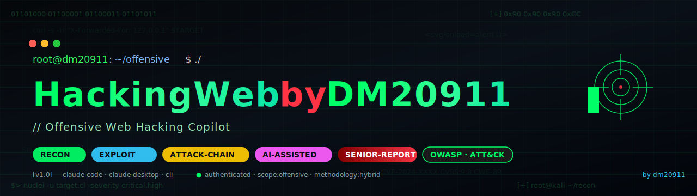
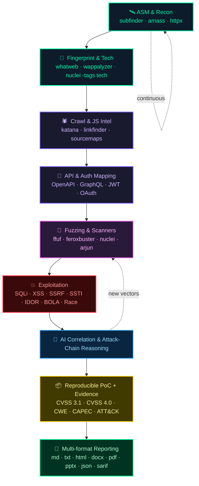

<p align="center">
  
</p>

# 🕷️ HackingWebbyDM20911

> **Offensive Web Hacking copilot** — recon, exploitation, AI-assisted correlation, attack chaining and senior multi-format reporting.

🌐 **Languages:** [Español](README.md) · [English](README.en.md) · [Português](README.pt.md) · [Français](README.fr.md) · [Deutsch](README.de.md) · [Italiano](README.it.md) · [日本語](README.ja.md)

Claude Code / Claude Desktop skill for offensive web pentesting professionals. Bundles methodology, tooling, recommended MCPs and a built-in multi-format report generator (Markdown, Word, PDF, HTML, PowerPoint, JSON, SARIF).

---

## What it does

End-to-end offensive copilot:

- **Recon / OSINT / ASM** — subdomains, endpoints, JS intel, source maps, secret hunting.
- **Fuzzing & Scanners** — ffuf, feroxbuster, nuclei, sqlmap, dalfox, XSStrike.
- **Exploitation** — SQLi, XSS, SSRF, SSTI, deserialization, IDOR/BOLA, mass assignment.
- **Deep API testing** — REST, GraphQL (introspection, batching, depth, alias), SOAP.
- **Auth deep dive** — JWT, OAuth2/OIDC, SAML, sessions, MFA bypass, race conditions.
- **Cloud + K8s + CI/CD** — AWS/GCP/Azure SSRF + IAM, kube-hunter, GitHub Actions abuse.
- **Browser security** — CSP bypass, postMessage, Service Workers, XS-Leaks, SameSite.
- **Business logic abuse** — workflows, race, coupon/refund/transfer, escalation.
- **Attack chaining** — smart correlation to build critical chains.
- **Senior reporting** — CVSS 3.1 + 4.0, CWE, CAPEC, ATT&CK, attack chains, evidence; export to md/docx/pdf/html/pptx.

---

## How to invoke

In **Claude Code** or **Claude Desktop**:

- `/hackweb`
- `/HackingWebbyDM20911`
- *"audit this web app"*, *"recon target.cl"*, *"pentest this API"*
- *"exploit this vuln"*, *"hunt BOLA / IDOR"*, *"SSRF in this param"*
- *"review OAuth/JWT"*, *"attack this GraphQL"*
- *"generate the offensive report"*

The skill always asks for methodology and minimal data before executing anything active.

---

## Boot — methodology selection

First step, before any active execution:

```
Which methodology do you want to work with?
  1. PTES
  2. OWASP WSTG
  3. NIST SP 800-115
  4. OSSTMM
  5. MITRE ATT&CK
  6. CWE / CAPEC
  7. Hybrid (combine several)
  8. Manual selection
```

The choice persists as project memory so the skill won't ask again in subsequent sessions of the same engagement. See `references/methodologies.md`.

---

## Offensive pipeline



---

## Tooling stack

<div align="center">


#### 🛰️ Recon / OSINT / ASM

[](https://github.com/projectdiscovery/subfinder) [](https://github.com/owasp-amass/amass) [](https://github.com/tomnomnom/assetfinder) [](https://github.com/Findomain/Findomain) [](https://github.com/projectdiscovery/httpx) [](https://github.com/projectdiscovery/katana) [](https://github.com/hakluke/hakrawler) [](https://github.com/lc/gau) [](https://github.com/tomnomnom/waybackurls) [](https://github.com/projectdiscovery/dnsx) [](https://github.com/projectdiscovery/naabu) [](https://github.com/robertdavidgraham/masscan) [](https://nmap.org) [](https://github.com/michenriksen/aquatone) [](https://github.com/lanmaster53/recon-ng) [](https://github.com/laramies/theHarvester)

#### 🛰️ Proxy / Interceptación

[](https://portswigger.net/burp) [](https://www.zaproxy.org) [](https://caido.io) [](https://mitmproxy.org) [](https://github.com/projectdiscovery/proxify)

#### 🎯 Fuzzing

[](https://github.com/ffuf/ffuf) [](https://github.com/epi052/feroxbuster) [](https://github.com/maurosoria/dirsearch) [](https://github.com/OJ/gobuster) [](https://github.com/s0md3v/Arjun) [](https://github.com/devanshbatham/ParamSpider) [](https://github.com/tomnomnom/qsreplace) [](https://github.com/Emoe/kxss)

#### 🧪 Vulnerability Scanners

[](https://github.com/projectdiscovery/nuclei) [](https://github.com/sullo/nikto) [](https://www.tenable.com/products/nessus) [](https://www.acunetix.com) [](https://www.invicti.com)

#### 💉 SQL Injection

[](https://sqlmap.org) [](https://github.com/r0oth3x49/ghauri) [](https://github.com/codingo/NoSQLMap)

#### 🪲 XSS

[](https://github.com/s0md3v/XSStrike) [](https://github.com/hahwul/dalfox) [](https://github.com/Emoe/kxss) [](https://xsshunter.com)

#### 🔌 APIs

[](https://www.postman.com) [](https://github.com/doyensec/inql) [](https://github.com/swisskyrepo/GraphQLmap) [](https://github.com/schemathesis/schemathesis) [](https://github.com/flipkart-incubator/Astra)

#### 🔐 Auth / JWT

[](https://github.com/ticarpi/jwt_tool) [](https://github.com/lmammino/jwt-cracker) [](https://github.com/vanhauser-thc/thc-hydra) [](https://github.com/lanjelot/patator) [](https://github.com/SecurityInnovation/AuthMatrix)

#### 🛰️ SSRF / SSTI / Deserialization

[](https://github.com/swisskyrepo/SSRFmap) [](https://github.com/epinna/tplmap) [](https://github.com/frohoff/ysoserial) [](https://github.com/projectdiscovery/interactsh)

#### 🧱 CMS

[](https://github.com/wpscanteam/wpscan) [](https://github.com/SamJoan/droopescan) [](https://github.com/OWASP/joomscan)

#### 📜 JS / Secrets

[](https://github.com/GerbenJavado/LinkFinder) [](https://github.com/m4ll0k/SecretFinder) [](https://retirejs.github.io/retire.js/) [](https://semgrep.dev) [](https://github.com/trufflesecurity/trufflehog) [](https://github.com/gitleaks/gitleaks)

#### ☁️ Cloud / K8s / CI-CD

[](https://github.com/nccgroup/ScoutSuite) [](https://github.com/prowler-cloud/prowler) [](https://github.com/RhinoSecurityLabs/pacu) [](https://github.com/aquasecurity/kube-hunter) [](https://github.com/aquasecurity/trivy) [](https://github.com/docker/docker-bench-security) [](https://github.com/synacktiv/octoscan) [](https://github.com/woodruffw/zizmor)

#### 📚 Wordlists / Payloads

[](https://github.com/danielmiessler/SecLists) [](https://github.com/swisskyrepo/PayloadsAllTheThings) [](https://github.com/fuzzdb-project/fuzzdb) [](https://wordlists.assetnote.io)


</div>


### Quick commands

```bash
# Full recon
subfinder -d target.cl -all -silent | dnsx -silent | httpx -title -tech-detect -o live.txt

# JS endpoint mining
katana -u https://target.cl -d 5 -jc -kf all -o endpoints.txt

# Fast vuln scan
nuclei -u https://target.cl -severity critical,high -o nuclei.txt

# Fuzzing
ffuf -u https://target.cl/FUZZ -w wordlists/raft-medium-directories.txt -ac -mc 200,301,302,401,403

# Automated SQLi
sqlmap -u "https://target.cl/api?id=1" --batch --level=3 --risk=2

# JWT crack
jwt_tool eyJ... -C -d rockyou.txt

# OOB callback
interactsh-client -v
```

---

## Report generator

Multi-format Python script at `scripts/generate_report.py`.

| Flag | Output | Typical use |
|------|--------|-------------|
| `--format md` | Markdown | Repo / GitHub issue / commit |
| `--format txt` | Plain text | Plain ticket |
| `--format html` | Standalone styled HTML | Quick web view |
| `--format docx` | Word with justified text, severity-colored cells, terminal-style code blocks | Client editable |
| `--format pdf` | PDF (via weasyprint) | Final signed deliverable |
| `--format pptx` | PowerPoint with cover, executive summary, severity matrix, top findings, conclusion | **Simple results presentation** |
| `--format json` | Normalized JSON | Knowledge graph ingest |
| `--format all` | Everything in one directory | Full delivery |

```bash
python3 scripts/generate_report.py --input findings.json --format docx --output report.docx
python3 scripts/generate_report.py --input findings.json --format all --output ./out/
```

See `assets/example_findings.json` for input schema. 
---

## Tutorials

### 1. Quick web pentest

```bash
> /hackweb audit https://demo.target.cl
# Pick methodology (e.g. "Hybrid: WSTG + ATT&CK + CWE")
# Skill executes pipeline:
subfinder -d demo.target.cl -all | httpx -title -tech-detect
nuclei -u https://demo.target.cl -severity critical,high
katana -u https://demo.target.cl -d 5 -jc | grep -E '/api/'
# Document findings.json, generate report
python3 scripts/generate_report.py -i findings.json -f docx -o report.docx
```

### 2. Bug bounty workflow

```bash
subfinder -d target.cl -all -silent | tee subs.txt
amass enum -passive -d target.cl >> subs.txt
sort -u subs.txt | dnsx -silent | httpx -title -tech-detect -o live.txt
katana -l live.txt -d 5 -jc -kf all -o endpoints.txt
nuclei -l live.txt -severity critical,high -tags exposure,cve -o nuclei.txt
python3 scripts/generate_report.py -i findings.json -f md -o report.md
```

### 3. Build your own MCP

```bash
pip install mcp[cli]
cat > recon_mcp.py <<'EOF'
from mcp.server.fastmcp import FastMCP
import subprocess
mcp = FastMCP("recon-mcp")
@mcp.tool()
def subdomains(domain: str) -> list[str]:
    out = subprocess.check_output(["subfinder", "-d", domain, "-silent"])
    return out.decode().splitlines()
if __name__ == "__main__": mcp.run()
EOF
claude mcp add recon-mcp -- python recon_mcp.py
```

### 4. Executive presentation in one command

```bash
python3 scripts/generate_report.py -i findings.json -f pptx -o presentation.pptx
open presentation.pptx
```

---

## MCPs

Recommended catalog in `references/mcp.md`.

**Existing / official:**

| MCP | Purpose |
|-----|---------|
| **[Burp Suite MCP Server](https://portswigger.net/bappstore/9952290f04ed4f628e624d0aa9dccebc)** (official PortSwigger) | Exposes Repeater, scanner, intercepted traffic and other Burp features to AI clients. Repo: [github.com/portswigger/mcp-server](https://github.com/portswigger/mcp-server) |

**Suggested blueprints to build** (the skill documents their capability surface; not yet published MCPs):

| MCP | Purpose |
|-----|---------|
| `nuclei-mcp` | Templates + finding correlation |
| `sqli-mcp` | SQLi detect + WAF evasion |
| `xss-mcp` | Payload mutation + CSP bypass gen |
| `api-security-mcp` | OpenAPI ingest + BOLA detection |
| `auth-mcp` | JWT analysis + race conditions |
| `cloud-web-mcp` | S3, K8s, IAM enum |
| `reporting-mcp` | Server-side report generation |
| `cvss-engine-mcp` | CVSS 3.1 + 4.0 calculation |
| `bugbounty-brain-mcp` | Persistent memory of bypasses + payloads |
| `web-attack-chain-mcp` | Suggest chains from findings |

---

## 🤖 Multi-AI support (optional)

Although the skill was born for **Claude Code / Claude Desktop**, it can also run on other copilots without touching the core. All host-specific logic lives in `adapters/`, kept separate from the rest.

| Host | Entry file used |
|------|-----------------|
| Claude Code / Claude Desktop | native `SKILL.md` (default) |
| **Gemini CLI** | `adapters/gemini/GEMINI.md` + `gemini-extension.json` |
| **Cursor** | `adapters/cursor/.cursorrules` |
| **Aider** | `adapters/aider/CONVENTIONS.md` + `.aider.conf.yml` |
| **OpenAI Codex CLI / OpenHands / generic** | `adapters/openai-codex/AGENTS.md` or `adapters/generic/AGENTS.md` |

**Auto-detection:**
```bash
bash adapters/install.sh                       # detect your available host
bash adapters/install.sh --host gemini         # force a host
bash adapters/install.sh --host cursor --project-dir /path
```

The installer detects `claude`, `gemini`, `cursor`, `aider`, `codex` (with fallback to `ANTHROPIC_API_KEY`, `GEMINI_API_KEY`, `OPENAI_API_KEY`). The Python report generator is host-agnostic and behaves identically everywhere.

Full details in [`adapters/README.md`](./adapters/README.md).

---

## Installation

### Claude Code
```bash
git clone https://github.com/DM20911/HackingWebbyDM20911 ~/.claude/skills/HackingWebbyDM20911
pip3 install python-docx python-pptx weasyprint markdown
```

### Claude Desktop
1. Build the bundle: `zip -r HackingWebbyDM20911.skill HackingWebbyDM20911 -x "*.git*"`
2. Import the `.skill` file in Settings → Capabilities → Skills.

PDF export needs `brew install pango cairo gdk-pixbuf libffi` plus `pip install weasyprint`.

---

## Project structure

```
HackingWebbyDM20911/
├── SKILL.md
├── README.md (es) + README.en/.pt/.fr/.de/.it/.ja.md
├── scripts/generate_report.py
├── assets/example_findings.json
└── references/  (36 specialized files loaded on demand)
```

---

## Philosophy

> Tools aren't what matters most. What matters is understanding HTTP, business logic, auth flows, trust boundaries, and thinking in attack chains.

This skill doesn't replace the pentester — it makes them 10x faster.

---

## Author

dm20911

## License

Authorized internal use.
