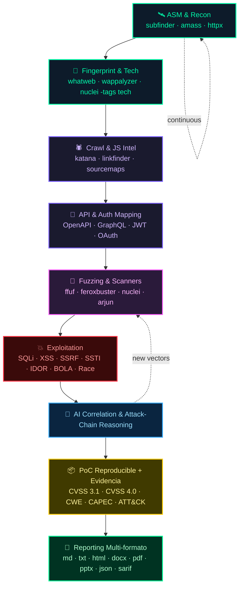

<p align="center">
  
</p>

# 🕷️ HackingWebbyDM20911

> **Offensive Web Hacking copilot** — recon, exploitation, AI-assisted correlation, attack chaining y reporting senior multi-formato.

🌐 **Idiomas:** [Español](README.md) · [English](README.en.md) · [Português](README.pt.md) · [Français](README.fr.md) · [Deutsch](README.de.md) · [Italiano](README.it.md) · [日本語](README.ja.md)

Skill de Claude Code / Claude Desktop para profesionales de pentesting web ofensivo. Empaqueta la metodología, las herramientas, los MCPs recomendados y un generador de informes propio (Markdown, Word, PDF, HTML, PowerPoint, JSON, SARIF).

---

## Índice

1. [¿Qué hace?](#qué-hace)
2. [Cómo se invoca](#cómo-se-invoca)
3. [Boot — selección de metodología](#boot--selección-de-metodología)
4. [Pipeline ofensivo](#pipeline-ofensivo)
5. [Stack de herramientas](#stack-de-herramientas)
6. [Generador de informes (multi-formato)](#generador-de-informes)
7. [Tutoriales paso a paso](#tutoriales)
8. [Integración con MCPs](#mcps)
9. [Instalación](#instalación)
10. [Estructura del proyecto](#estructura)

---

## ¿Qué hace?

Esta skill convierte a Claude en un copiloto ofensivo end-to-end:

- **Recon / OSINT / ASM** — subdominios, endpoints, JS intel, source maps, secret hunting.
- **Fuzzing & Scanners** — ffuf, feroxbuster, nuclei, sqlmap, dalfox, XSStrike.
- **Exploitation** — SQLi, XSS, SSRF, SSTI, deserialization, IDOR/BOLA, mass assignment.
- **APIs profundo** — REST, GraphQL (introspection, batching, depth, alias), SOAP.
- **Auth deep dive** — JWT, OAuth2/OIDC, SAML, sesiones, MFA bypass, race conditions.
- **Cloud + K8s + CI/CD** — AWS/GCP/Azure SSRF + IAM, kube-hunter, GitHub Actions abuse.
- **Browser security** — CSP bypass, postMessage, Service Workers, XS-Leaks, SameSite.
- **Business logic abuse** — workflows, race, coupon/refund/transfer, escalación.
- **Attack chaining** — correlación inteligente para construir chains críticos.
- **Reporting senior** — informes con CVSS 3.1 + 4.0, CWE, CAPEC, ATT&CK, attack chains, evidencia, exportables a md/docx/pdf/html/pptx.

---

## Cómo se invoca

En **Claude Code** o **Claude Desktop**, escribe alguno de estos:

- `/hackweb`
- `/HackingWebbyDM20911`
- *"audita esta web"*, *"haz recon a target.cl"*, *"pentest a esta API"*
- *"explota esta vuln"*, *"busca BOLA / IDOR"*, *"SSRF en este parámetro"*
- *"revisa OAuth/JWT"*, *"atacame esta GraphQL"*
- *"genera el informe ofensivo"*

La skill arranca preguntando metodología y datos mínimos antes de cualquier acción.

---

## Boot — selección de metodología

Primer paso siempre, antes de ejecutar nada activo:

```
¿Con qué metodología quieres trabajar?
  1. PTES
  2. OWASP WSTG
  3. NIST SP 800-115
  4. OSSTMM
  5. MITRE ATT&CK
  6. CWE / CAPEC
  7. Híbrida (combinar varias)
  8. Selección manual
```

El usuario puede elegir una o combinar. La elección se persiste como project memory para no preguntar de nuevo en sesiones siguientes del mismo engagement.

Detalle en `references/methodologies.md`.

---

## Pipeline ofensivo



<details>
<summary>Vista alternativa (terminal)</summary>

```
   ╭──────────────╮     ╭──────────────╮     ╭──────────────╮     ╭──────────────╮
   │ 🛰️  RECON   │ ──► │ 🔬 FINGER-  │ ──► │ 🕷️  CRAWL  │ ──► │ 🔐 API/AUTH │
   │  ASM/OSINT  │     │  PRINTING   │     │  & JS INTEL │     │   MAPPING   │
   ╰──────────────╯     ╰──────────────╯     ╰──────────────╯     ╰──────────────╯
                                                                          │
   ╭──────────────╮     ╭──────────────╮     ╭──────────────╮              │
   │ 📄 REPORTING │ ◄── │ 📦   PoC    │ ◄── │ 🧠 AI CHAIN │              │
   │ md/docx/pdf  │     │ +EVIDENCIA  │     │  REASONING  │              │
   │ html/pptx    │     │ +CVSS+CWE   │     │             │              │
   ╰──────────────╯     ╰──────────────╯     ╰──────────────╯              │
                                                  ▲                        │
                                                  │                        ▼
                                          ╭──────────────╮      ╭──────────────╮
                                          │ 💥 EXPLOIT  │ ◄── │ 🎯 FUZZING  │
                                          │ SQLi · XSS  │     │ + SCANNERS  │
                                          │ SSRF · BOLA │     │             │
                                          ╰──────────────╯      ╰──────────────╯
```
</details>

---

## Stack de herramientas

<div align="center">


#### 🛰️ Recon / OSINT / ASM

[](https://github.com/projectdiscovery/subfinder) [](https://github.com/owasp-amass/amass) [](https://github.com/tomnomnom/assetfinder) [](https://github.com/Findomain/Findomain) [](https://github.com/projectdiscovery/httpx) [](https://github.com/projectdiscovery/katana) [](https://github.com/hakluke/hakrawler) [](https://github.com/lc/gau) [](https://github.com/tomnomnom/waybackurls) [](https://github.com/projectdiscovery/dnsx) [](https://github.com/projectdiscovery/naabu) [](https://github.com/robertdavidgraham/masscan) [](https://nmap.org) [](https://github.com/michenriksen/aquatone) [](https://github.com/lanmaster53/recon-ng) [](https://github.com/laramies/theHarvester)

#### 🛰️ Proxy / Interceptación

[](https://portswigger.net/burp) [](https://www.zaproxy.org) [](https://caido.io) [](https://mitmproxy.org) [](https://github.com/projectdiscovery/proxify)

#### 🎯 Fuzzing

[](https://github.com/ffuf/ffuf) [](https://github.com/epi052/feroxbuster) [](https://github.com/maurosoria/dirsearch) [](https://github.com/OJ/gobuster) [](https://github.com/s0md3v/Arjun) [](https://github.com/devanshbatham/ParamSpider) [](https://github.com/tomnomnom/qsreplace) [](https://github.com/Emoe/kxss)

#### 🧪 Vulnerability Scanners

[](https://github.com/projectdiscovery/nuclei) [](https://github.com/sullo/nikto) [](https://www.tenable.com/products/nessus) [](https://www.acunetix.com) [](https://www.invicti.com)

#### 💉 SQL Injection

[](https://sqlmap.org) [](https://github.com/r0oth3x49/ghauri) [](https://github.com/codingo/NoSQLMap)

#### 🪲 XSS

[](https://github.com/s0md3v/XSStrike) [](https://github.com/hahwul/dalfox) [](https://github.com/Emoe/kxss) [](https://xsshunter.com)

#### 🔌 APIs

[](https://www.postman.com) [](https://github.com/doyensec/inql) [](https://github.com/swisskyrepo/GraphQLmap) [](https://github.com/schemathesis/schemathesis) [](https://github.com/flipkart-incubator/Astra)

#### 🔐 Auth / JWT

[](https://github.com/ticarpi/jwt_tool) [](https://github.com/lmammino/jwt-cracker) [](https://github.com/vanhauser-thc/thc-hydra) [](https://github.com/lanjelot/patator) [](https://github.com/SecurityInnovation/AuthMatrix)

#### 🛰️ SSRF / SSTI / Deserialization

[](https://github.com/swisskyrepo/SSRFmap) [](https://github.com/epinna/tplmap) [](https://github.com/frohoff/ysoserial) [](https://github.com/projectdiscovery/interactsh)

#### 🧱 CMS

[](https://github.com/wpscanteam/wpscan) [](https://github.com/SamJoan/droopescan) [](https://github.com/OWASP/joomscan)

#### 📜 JS / Secrets

[](https://github.com/GerbenJavado/LinkFinder) [](https://github.com/m4ll0k/SecretFinder) [](https://retirejs.github.io/retire.js/) [](https://semgrep.dev) [](https://github.com/trufflesecurity/trufflehog) [](https://github.com/gitleaks/gitleaks)

#### ☁️ Cloud / K8s / CI-CD

[](https://github.com/nccgroup/ScoutSuite) [](https://github.com/prowler-cloud/prowler) [](https://github.com/RhinoSecurityLabs/pacu) [](https://github.com/aquasecurity/kube-hunter) [](https://github.com/aquasecurity/trivy) [](https://github.com/docker/docker-bench-security) [](https://github.com/synacktiv/octoscan) [](https://github.com/woodruffw/zizmor)

#### 📚 Wordlists / Payloads

[](https://github.com/danielmiessler/SecLists) [](https://github.com/swisskyrepo/PayloadsAllTheThings) [](https://github.com/fuzzdb-project/fuzzdb) [](https://wordlists.assetnote.io)


</div>


### Comandos rápidos típicos

```bash
# Recon completo
subfinder -d target.cl -all -silent | dnsx -silent | httpx -title -tech-detect -o live.txt

# Endpoints desde JS bundles
katana -u https://target.cl -d 5 -jc -kf all -o endpoints.txt

# Vuln scan rápido
nuclei -u https://target.cl -severity critical,high -o nuclei.txt

# Fuzzing
ffuf -u https://target.cl/FUZZ -w wordlists/raft-medium-directories.txt -ac -mc 200,301,302,401,403

# SQLi automatizado
sqlmap -u "https://target.cl/api?id=1" --batch --level=3 --risk=2

# JWT crack
jwt_tool eyJ... -C -d rockyou.txt

# OOB callback
interactsh-client -v
```

Ver detalles por categoría en `references/`.

---

## Generador de informes

Script Python multi-formato en `scripts/generate_report.py`.

### Formatos soportados

| Flag | Output | Uso típico |
|------|--------|-----------|
| `--format md` | Markdown | Repo / GitHub issue / commit |
| `--format txt` | Texto plano | Ticket sin formato |
| `--format html` | HTML standalone con estilo | Vista web rápida |
| `--format docx` | Word con texto justificado, tablas con color por severidad, bloques de código tipo terminal | Cliente que edita |
| `--format pdf` | PDF (vía weasyprint) | Entregable final firmado |
| `--format pptx` | PowerPoint con portada, resumen ejecutivo, matriz por severidad, slide por hallazgo crítico, conclusión | **Presentación simple de resultados** |
| `--format json` | JSON normalizado | Ingesta a knowledge graph / SARIF |
| `--format all` | Todos a la vez en un directorio | Entrega completa |

### Uso

```bash
python3 scripts/generate_report.py --input findings.json --format docx --output informe.docx
python3 scripts/generate_report.py --input findings.json --format all --output ./out/
```

### JSON de entrada

Ver `assets/example_findings.json` para schema completo. Estructura:

```json
{
  "meta": { "titulo": "...", "cliente": "...", "tipo": "...", "fecha": "...", "clasificacion": "...", "version": "1.0", "autor": "..." },
  "introduccion": "...",
  "resumen_ejecutivo": "...",
  "alcance": "...",
  "metodologia": "...",
  "findings": [
    {
      "titulo": "...",
      "severidad": "Crítica | Alta | Media | Baja | Info",
      "cvss31_score": 9.1,
      "cvss31_vector": "CVSS:3.1/...",
      "cvss40_score": 8.7,
      "cvss40_vector": "CVSS:4.0/...",
      "cwe": "CWE-639 — ...",
      "capec": "CAPEC-39",
      "owasp": "API1:2023 — ...",
      "attack": "T1190",
      "activo": "https://...",
      "parametro": "path id",
      "descripcion": "...",
      "impacto": "Un atacante podría ...",
      "riesgo_negocio": "...",
      "confidence": "High",
      "validacion_manual": "Sí",
      "probabilidad": "Alta",
      "evidencia": "...",
      "poc": [
        {
          "descripcion": "Qué hace el comando, qué resultado tendrá, qué llamar la atención.",
          "cmd": "curl ...",
          "output": "HTTP/1.1 200 OK ..."
        }
      ],
      "remediacion": "...",
      "referencias": ["..."],
      "estado": "Confirmado"
    }
  ],
  "attack_chains": [
    { "nombre": "...", "componentes": ["..."], "cvss_agregado": "9.8", "descripcion": "..." }
  ],
  "timeline": ["2026-05-08 Recon", "..."],
  "limitaciones": "...",
  "conclusion": "...",
  "anexos": { "Herramientas": "...", "Wordlists": "..." }
}
```

---

## Tutoriales

### Tutorial 1: pentest web rápido

```bash
# 1. Invocar la skill
> /hackweb audita https://demo.target.cl

# 2. Responder metodología (ej: "Híbrida: WSTG + ATT&CK + CWE")

# 3. La skill ejecuta el pipeline:
subfinder -d demo.target.cl -all | httpx -title -tech-detect
nuclei -u https://demo.target.cl -severity critical,high
katana -u https://demo.target.cl -d 5 -jc | grep -E '/api/'

# 4. Documenta hallazgos en findings.json

# 5. Genera informe
python3 scripts/generate_report.py -i findings.json -f docx -o informe.docx
```

### Tutorial 2: bug bounty workflow

```bash
# Recon pasivo amplio
subfinder -d target.cl -all -silent | tee subs.txt
amass enum -passive -d target.cl >> subs.txt
sort -u subs.txt | dnsx -silent | httpx -title -tech-detect -o live.txt

# Crawl + JS intel
katana -l live.txt -d 5 -jc -kf all -o endpoints.txt
cat endpoints.txt | grep -E '\.js$' | xargs -I{} curl -sk {} | grep -oE '(api[_-]?key|secret|token)["\047]?\s*[:=]\s*["\047][^"\047]+'

# Vuln scan
nuclei -l live.txt -severity critical,high -tags exposure,cve -o nuclei.txt

# Reportar a la plataforma con findings.json + render md
python3 scripts/generate_report.py -i findings.json -f md -o report.md
```

### Tutorial 3: configurar un MCP propio

```bash
# 1. Crear esqueleto Python
pip install mcp[cli]

cat > recon_mcp.py <<'EOF'
from mcp.server.fastmcp import FastMCP
import subprocess
mcp = FastMCP("recon-mcp")

@mcp.tool()
def subdomains(domain: str) -> list[str]:
    out = subprocess.check_output(["subfinder", "-d", domain, "-silent"])
    return out.decode().splitlines()

if __name__ == "__main__":
    mcp.run()
EOF

# 2. Registrar en Claude Code
claude mcp add recon-mcp -- python recon_mcp.py

# 3. Verificar
claude mcp list
```

### Tutorial 4: presentación ejecutiva en 1 comando

```bash
python3 scripts/generate_report.py -i findings.json -f pptx -o presentacion.pptx
open presentacion.pptx
```

Genera: portada, slide de resumen ejecutivo, matriz por severidad, slide por hallazgo Crítico/Alto, slide de conclusión.

---

## MCPs

Catálogo recomendado en `references/mcp.md`. Resumen:

**Existentes / oficiales:**

| MCP | Para qué |
|-----|----------|
| **[Burp Suite MCP Server](https://portswigger.net/bappstore/9952290f04ed4f628e624d0aa9dccebc)** (oficial PortSwigger) | Expone Repeater, scanner, tráfico interceptado y demás funciones de Burp a clientes IA. Repo: [github.com/portswigger/mcp-server](https://github.com/portswigger/mcp-server) |

**Blueprints sugeridos para construir** (la skill documenta su superficie de capacidades; aún no son MCPs publicados):

| MCP | Para qué |
|-----|----------|
| `nuclei-mcp` | Templates + correlación de findings |
| `sqli-mcp` | SQLi detect + WAF evasion |
| `xss-mcp` | Payload mutation + CSP bypass gen |
| `api-security-mcp` | OpenAPI ingest + BOLA detection |
| `auth-mcp` | JWT analysis + race conditions |
| `cloud-web-mcp` | S3, K8s, IAM enum |
| `reporting-mcp` | Generación de reports server-side |
| `cvss-engine-mcp` | Calcular CVSS 3.1 + 4.0 |
| `bugbounty-brain-mcp` | Memoria persistente de bypasses + payloads |
| `web-attack-chain-mcp` | Sugerir chains a partir de findings |

---

## 🤖 Soporte multi-IA (opcional)

Aunque la skill nació para **Claude Code / Claude Desktop**, también puede usarse desde otros copilotos sin tocar el núcleo. Toda la lógica de host vive en `adapters/`, separada del resto.

| Host | Cómo lo usa |
|------|-------------|
| Claude Code / Claude Desktop | `SKILL.md` nativo (default) |
| **Gemini CLI** | `adapters/gemini/GEMINI.md` + `gemini-extension.json` |
| **Cursor** | `adapters/cursor/.cursorrules` |
| **Aider** | `adapters/aider/CONVENTIONS.md` + `.aider.conf.yml` |
| **OpenAI Codex CLI / OpenHands / genéricos** | `adapters/openai-codex/AGENTS.md` o `adapters/generic/AGENTS.md` |

**Auto-detección:**
```bash
bash adapters/install.sh                       # detecta tu host disponible
bash adapters/install.sh --host gemini         # forzar host
bash adapters/install.sh --host cursor --project-dir /ruta
```

El instalador detecta `claude`, `gemini`, `cursor`, `aider`, `codex` (y como fallback variables `ANTHROPIC_API_KEY`, `GEMINI_API_KEY`, `OPENAI_API_KEY`). El generador de informes Python es agnóstico y funciona idéntico en cualquier host.

Detalles completos en [`adapters/README.md`](./adapters/README.md).

---

## Instalación

### Claude Code

```bash
git clone https://github.com/DM20911/HackingWebbyDM20911 ~/.claude/skills/HackingWebbyDM20911
pip3 install python-docx python-pptx weasyprint markdown
```

### Claude Desktop

1. Empaquetar (desde repo clonado):
   ```bash
   python3 -m scripts.package_skill ~/.claude/skills/HackingWebbyDM20911
   ```
2. Importar el `.skill` resultante en Settings → Capabilities → Skills.

### Dependencias del generador de informes

```bash
pip3 install python-docx python-pptx weasyprint markdown
```

PDF requiere weasyprint (en macOS necesita `brew install pango cairo gdk-pixbuf libffi`).

---

## Estructura

```
HackingWebbyDM20911/
├── SKILL.md                     # Brain de la skill (cargado siempre)
├── README.md                    # Este archivo
├── scripts/
│   └── generate_report.py       # Generador multi-formato
├── assets/
│   └── example_findings.json    # Ejemplo de input para el generador
└── references/                  # Cargadas bajo demanda según fase
    ├── methodologies.md
    ├── recon.md
    ├── proxy.md
    ├── fuzzing.md
    ├── scanners.md
    ├── sqli.md
    ├── xss.md
    ├── api.md
    ├── graphql.md
    ├── auth.md
    ├── advanced-vulns.md
    ├── cms.md
    ├── js-intel.md
    ├── cloud.md
    ├── cicd.md
    ├── secrets.md
    ├── race-conditions.md
    ├── desync.md
    ├── cache-attacks.md
    ├── browser-sec.md
    ├── business-logic.md
    ├── mobile-web.md
    ├── evasion.md
    ├── attack-chains.md
    ├── correlation.md
    ├── prioritization.md
    ├── wordlists.md
    ├── labs.md
    ├── opsec.md
    ├── legal.md
    ├── reporting.md
    ├── cvss.md
    ├── mcp.md
    ├── ai-memory.md
    ├── agents.md
    └── roadmap.md
```

---

## Filosofía

> Las herramientas no son lo más importante. Lo importante es entender HTTP, lógica de negocio, auth flows, trust boundaries, y pensar en attack chains.

Esta skill no reemplaza al pentester — lo hace 10x más rápido.

---

## Autor

dm20911

## Licencia

Uso interno autorizado.
